# Proyecto Catálogo con JPA e Hibernate

Este proyecto es una aplicación web MVC desarrollada con **Spring Boot**, **Spring Data JPA**, **Hibernate**, y **Thymeleaf**, respaldada por una base de datos **MySQL 8**. El propósito principal de la aplicación es proveer un CRUD para administrar Categorías y Productos con sus respectivas relaciones de base de datos.

## Resumen

- **Parte 1**: Implementación de un CRUD completo para la entidad `Categoria`. Se implementó la persistencia de datos mediante Spring Data JPA y validaciones estrictas (`@NotBlank`, `@Size`) para asegurar que el nombre de cada categoría sea único y obligatorio.
- **Parte 2**: Adición de la entidad `Producto` con una relación bidireccional `@ManyToOne` (en `Producto`) y `@OneToMany` (en `Categoria`). Se incluyen endpoints para crear, listar, editar y eliminar productos, además de un filtro avanzado utilizando JPQL y `JOIN FETCH`.

## Decisiones de Diseño

1. **`ddl-auto=update`**:
   Se configuró `spring.jpa.hibernate.ddl-auto=update` en lugar de `create` para que Hibernate preserve los datos insertados entre reinicios del servidor, al mismo tiempo que añade tablas y columnas nuevas automáticamente (útil para el ciclo de desarrollo al agregar la entidad `Producto` después de `Categoria`). En producción, lo ideal sería utilizar `validate` o `none` con herramientas como Flyway/Liquibase.
2. **`unique=true` validado en la capa de Servicios**:
   La restricción en base de datos (`@Column(unique=true)`) se acompaña de una validación previa en `CategoriaService.guardar` que lanza `IllegalStateException` y se maneja graciosamente en el controlador (usando `BindingResult.rejectValue`) para mostrar el error al usuario final sin emitir una página de error HTTP 500 genérica.
3. **Manejo de `FetchType.LAZY` y N+1**:
   Se definió de forma explícita `FetchType.LAZY` en el `@ManyToOne` de `Producto`, ya que su defecto es EAGER, lo que podría acarrear problemas de rendimiento con consultas N+1. Para evitar `LazyInitializationException`, se usan consultas JPQL customizadas con `JOIN FETCH` cuando se requiere listar productos mostrando su categoría.
4. **Protección al Eliminar (`CascadeType.REMOVE`)**:
   No se utilizó `cascade = CascadeType.REMOVE` en la colección de productos de la categoría. En su lugar, el `CategoriaService` se asegura de verificar si la lista de productos está vacía; si no lo está, lanza una excepción capturada por el controlador, previniendo el borrado en cascada accidental.

### Diagrama de Relación
```text
  Categoria 1 ────────────── N Producto
 (id, nombre)                  (id, nombre, precio, stock, categoria_id)
```

## Configuración de Base de Datos y Ejecución

Se requiere una instancia de **MySQL 8**. Puedes crearla localmente o usando Docker:
```bash
docker run -d --name mysql-catalogo -p 3306:3306 -e MYSQL_ROOT_PASSWORD=root mysql:8
```
Asegúrate de ejecutar el script de creación inicial para inicializar la base de datos y usuario:
```sql
CREATE DATABASE catalogo_db CHARACTER SET utf8mb4 COLLATE utf8mb4_unicode_ci;
CREATE USER 'appuser'@'%' IDENTIFIED BY 'apppass';
GRANT ALL PRIVILEGES ON catalogo_db.* TO 'appuser'@'%';
FLUSH PRIVILEGES;
```

**Credenciales Configurados en `application.properties`**:
- URL: `jdbc:mysql://localhost:3306/catalogo_db?useSSL=false&serverTimezone=UTC`
- Usuario: `appuser`
- Clave: `apppass`

### Ejecución
Para arrancar la aplicación, dirígete a la carpeta `catalogo-jpa` y ejecuta:
```bash
./mvnw spring-boot:run
```
La aplicación se servirá en http://localhost:8080/.
Endpoints principales:
- Categorías: http://localhost:8080/categorias
- Productos: http://localhost:8080/productos

## Lista de Funcionalidades

- **CRUD de Categorías:** Crear, visualizar, editar y eliminar categorías.
- **Validación de Categorías:** Nombres únicos, con campos obligatorios validados (largo, presencia).
- **Relaciones Bidireccionales JPA:** Mantenimiento transparente de ambas caras de la asociación `@OneToMany` usando helper methods (`agregarProducto`, `quitarProducto`).
- **CRUD de Productos:** Gestión completa del catálogo de productos con la selección obligatoria de su categoría.
- **Filtro de Productos usando JPQL:** Filtrado combinado por Categoría y Precio Mínimo mayor a, enlazando objetos perezosos con JOIN FETCH en una única query optimizada.
- **Vistas dinámicas con Thymeleaf:** Recarga de errores en formularios (`BindingResult`), re-poblado automático, validaciones visibles y ventanas de confirmación seguras (con POST paramétrico y método PRG - Post/Redirect/Get).

## Capturas de Pantalla (Evidencia)

**Parte 1:**
- Tabla en base de datos al inicio: 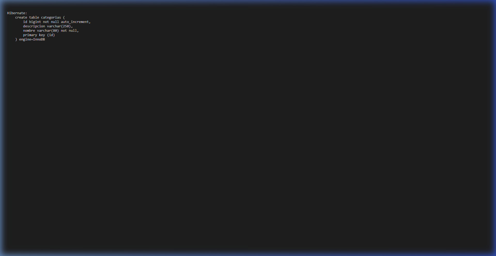
- SHOW TABLES MySQL: 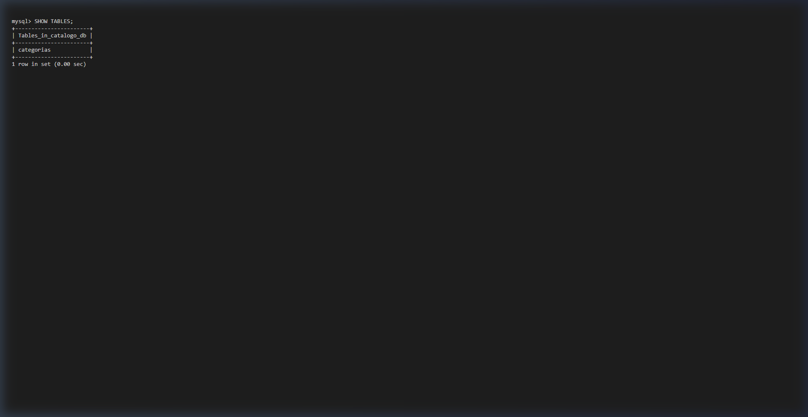
- Formulario de Categoría: 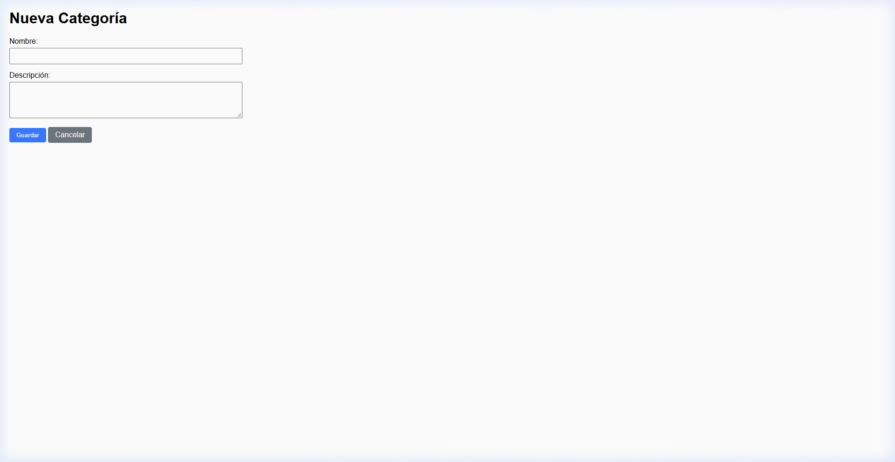
- Lista de Categorías: 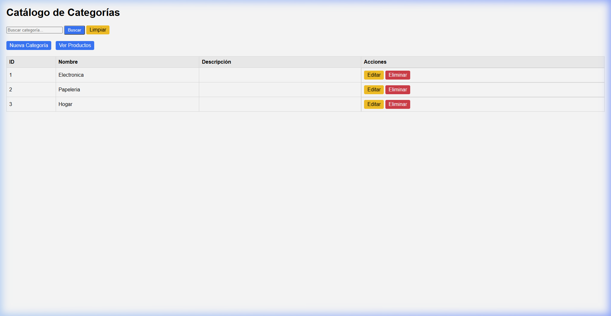
- Validación Duplicada: 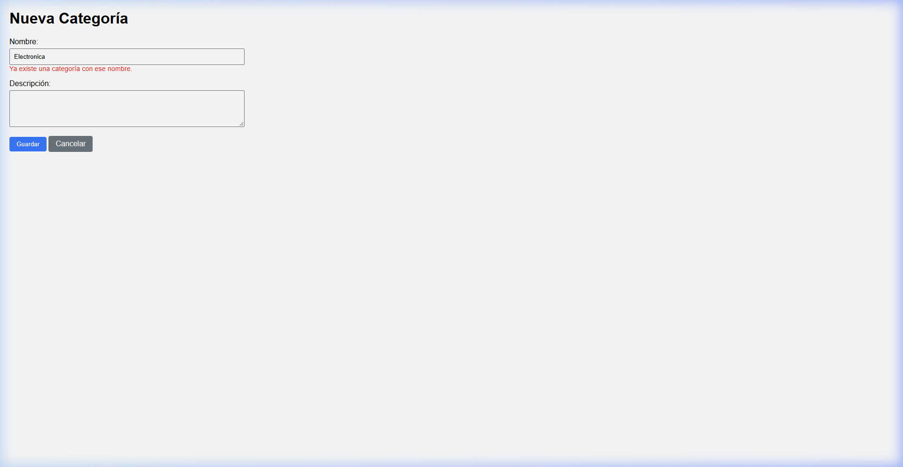

**Parte 2:**
- Descripción Tabla Producto (`DESCRIBE productos`): 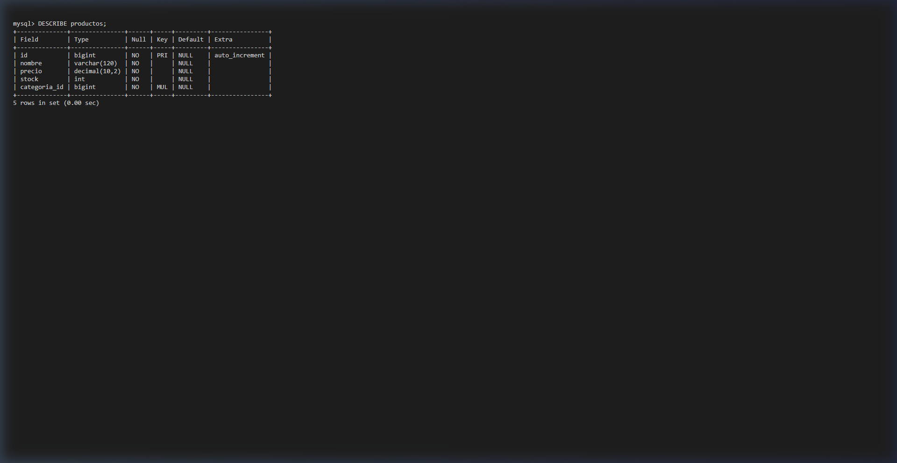
- Formulario de Producto (Selección de Categoría): 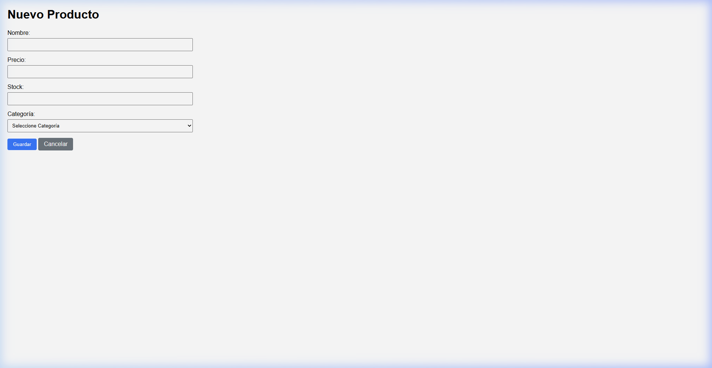
- Lista de Productos (Aparece el nombre de Categoría): 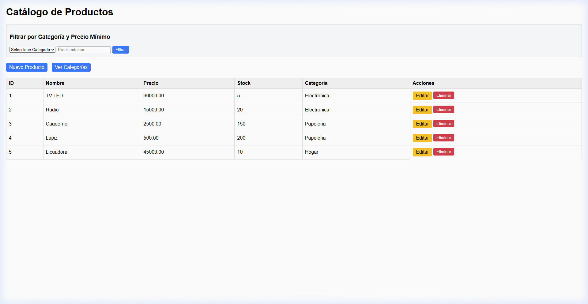
- Productos Filtrados (> 40000): 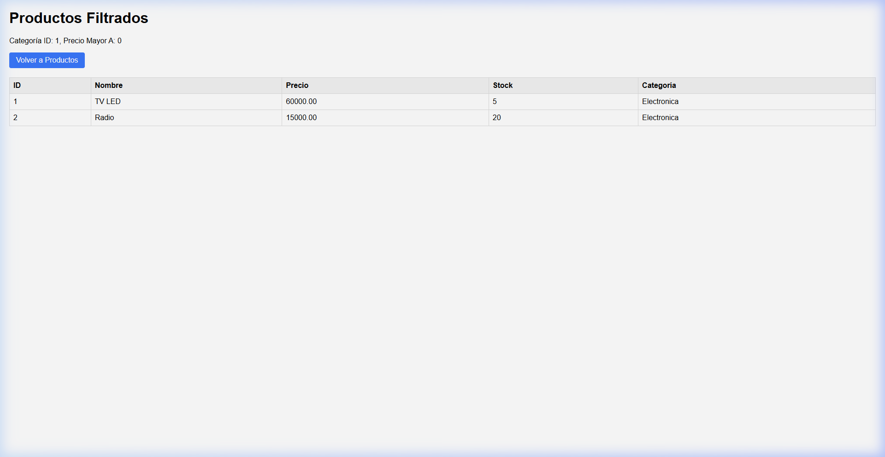
- Query con JOIN FETCH: 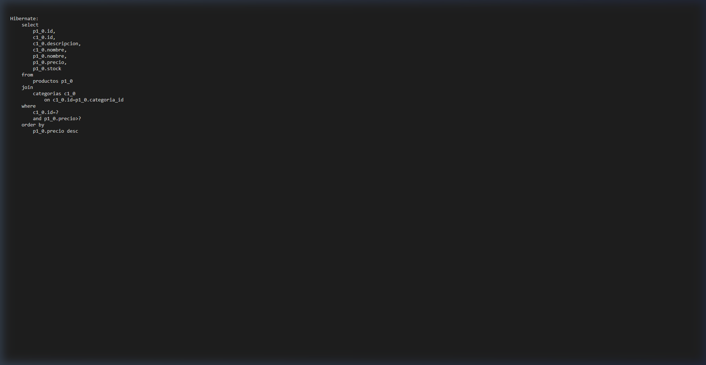
- Error de Categoría con Productos Relacionados: 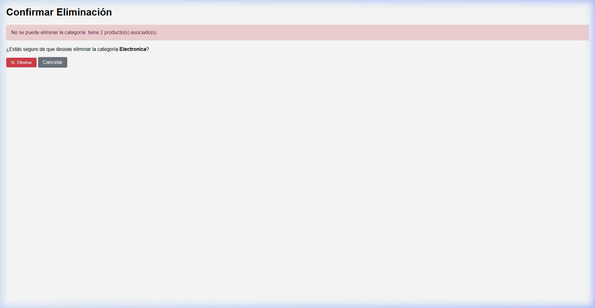
- Selección en consola de Productos (`SELECT * FROM productos`): 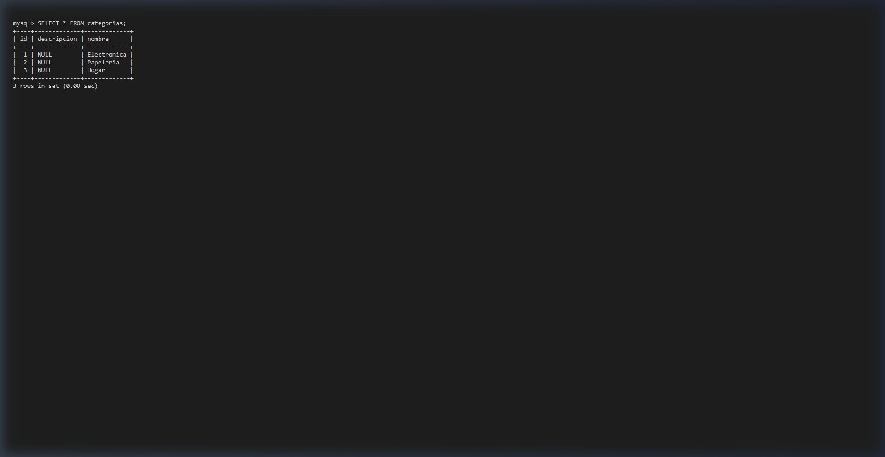
